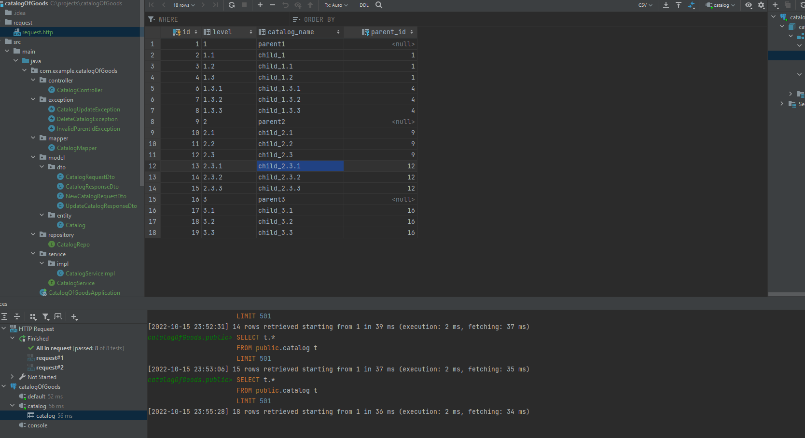
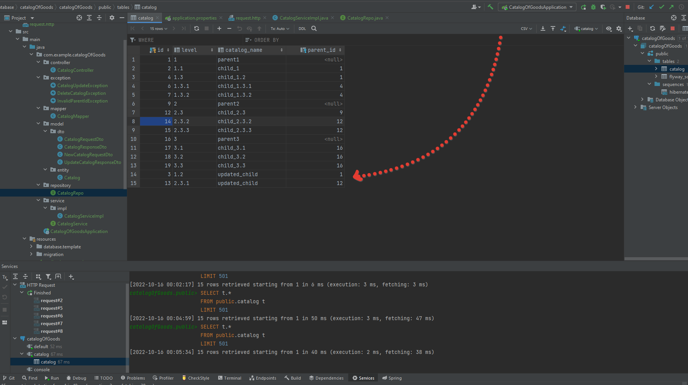
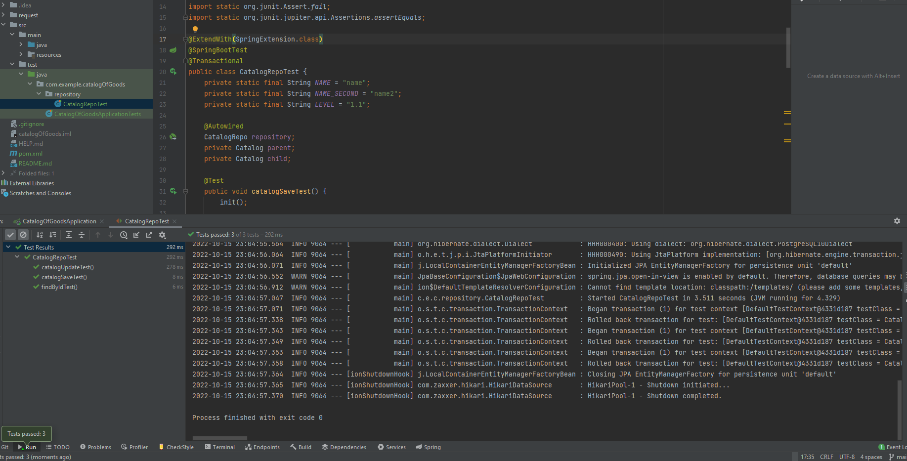
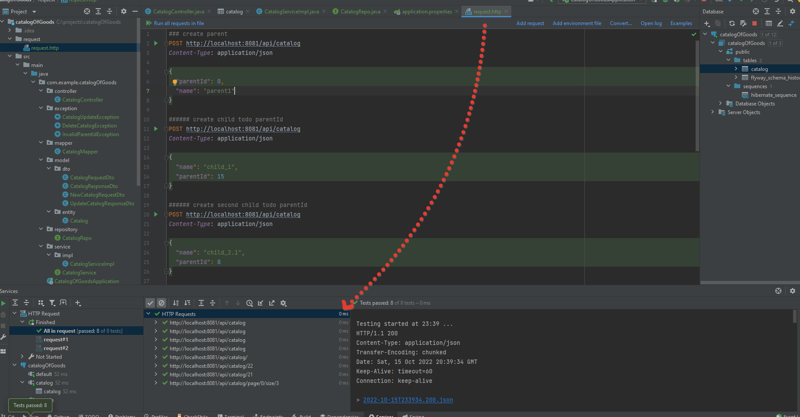
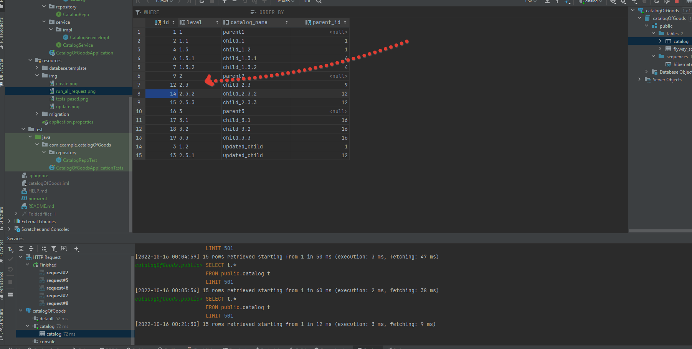

<h1 align="center">Hi there, I'm <a href="" target="_blank">Roman Manko</a> 
</h1>
<h3 align="center">Java developer from Russia </h3>

This project was realized three structure.

Here are some of the technologies that were used in this rest project:
Spring boot, maven, lombok, postgresql, flyway, junit.

To launch a project, you need to use: CatalogOfGoodsApplication

The necessary settings for connecting the database and flyway are in the file: application.properties

Some examples how it worked:

Save:

Update:

Test run:

Http request:

Delete
